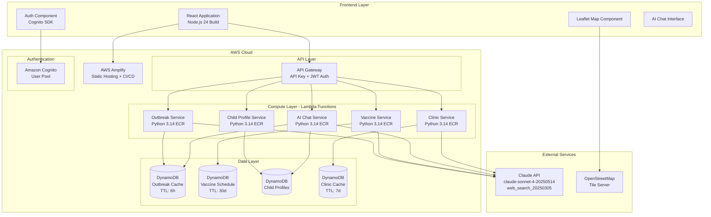
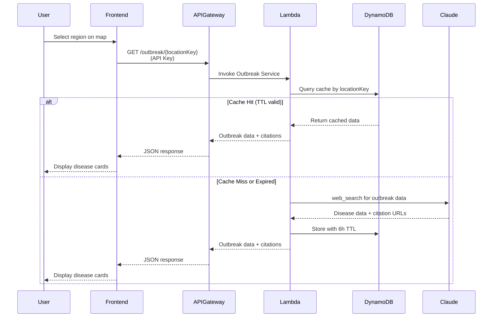
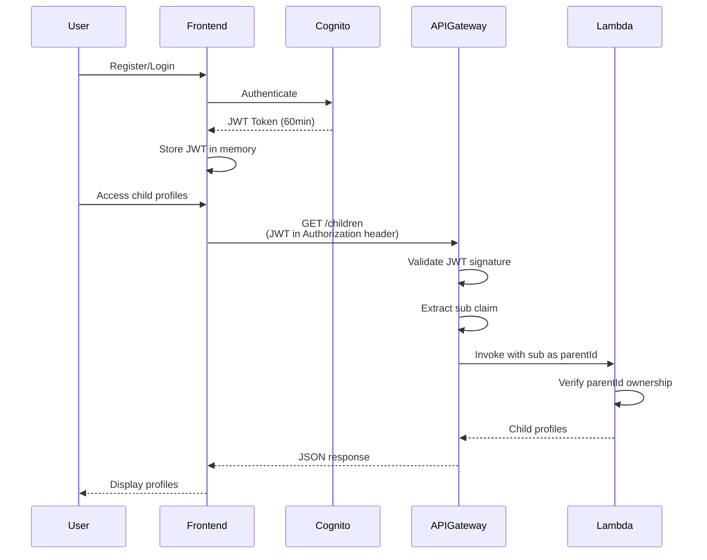
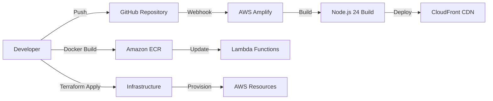

# VacciMap Design Document

## Overview

VacciMap is a full-stack infectious disease hazard map and child vaccination management application built for the TerraCode Convergence hackathon. The system combines real-time disease outbreak monitoring with personalized vaccination schedule management, leveraging Claude AI's web search capabilities for data retrieval and risk assessment.

### System Goals

- Provide real-time infectious disease risk visualization for Japan and US regions
- Enable parents to manage child vaccination schedules with AI-powered guidance
- Minimize operational costs through aggressive caching strategies
- Deliver fast, responsive user experience with sub-3-second map rendering
- Maintain data freshness while optimizing Claude API usage

### Technology Stack

**Frontend:**
- React with Node.js 24 build tooling
- Leaflet + OpenStreetMap for map visualization
- i18n support (Japanese/English)
- AWS Amplify hosting and CI/CD

**Backend:**
- Python 3.14 Lambda functions in ECR containers
- Amazon API Gateway with API key protection
- Amazon Cognito for authentication
- DynamoDB for caching with TTL
- Claude API (claude-sonnet-4-20250514) with web_search_20250305

**Infrastructure:**
- Terraform 1.14 for IaC
- mise for tool version management
- AWS free tier optimization

## Architecture

### High-Level System Architecture



### Data Flow Architecture



### 3-Tier Location Hierarchy

The system uses a hierarchical location model to optimize caching and data retrieval:

```
Country (Tier 1)
  └── Prefecture/State (Tier 2)
        └── Ward/City (Tier 3)
```

**Location Key Format:** `country#prefecture#ward` (lowercase, e.g., `japan#tokyo#nerima`)

**Caching Strategy:**
- Query from most specific (Tier 3) to least specific (Tier 1)
- Cache at each tier independently
- Aggregate data when displaying regional summaries

### Authentication Flow



## Components and Interfaces

### Frontend Components

#### 1. Map Component
**Responsibility:** Render interactive hazard map with disease risk visualization

**Key Features:**
- Leaflet integration with OpenStreetMap tiles
- Region coloring based on risk levels (green/yellow/red/dark red)
- Click handlers for region selection
- Clinic markers with popup details
- Search functionality for address/postal code

**State Management:**
- Selected region (locationKey)
- Outbreak data for visible regions
- Map center and zoom level
- Active language (ja/en)

#### 2. Side Panel Component
**Responsibility:** Display detailed information for selected region

**Sections:**
- Area information (name, population)
- Disease cards (7 disease types with case counts, trends, severity)
- Citation links for data sources
- Nearby clinics list

#### 3. Child Profile Manager
**Responsibility:** CRUD operations for child profiles

**Features:**
- Profile creation form (name, birthdate, gender, location)
- Profile list view
- Edit/delete actions with confirmation
- Vaccination schedule display per child

#### 4. Vaccination Tracker
**Responsibility:** Display and manage vaccination records

**Features:**
- Timeline view of vaccinations (completed/upcoming/overdue/scheduled)
- Mark as completed with date picker
- Schedule future vaccinations
- Add notes to records
- Visual indicators for overdue vaccinations (>30 days)

#### 5. AI Chat Interface
**Responsibility:** Conversational health guidance

**Features:**
- Message input with streaming response display
- Conversation history within session
- Context injection (child profile + outbreak data)
- Disclaimer display
- Language-aware responses

#### 6. Authentication Components
**Responsibility:** User registration, login, password management

**Features:**
- Registration form with email verification
- Login form with JWT token management
- Password reset flow
- Session management (60-minute token expiry)

### Backend Lambda Functions

#### 1. Outbreak Service Lambda
**Runtime:** Python 3.14 in ECR container  
**Trigger:** API Gateway GET /outbreak/{locationKey}  
**Authentication:** API Key required

**Function Signature:**
```python
def handler(event: dict, context: LambdaContext) -> dict:
    """
    Retrieve outbreak data for a location.
    
    Args:
        event: API Gateway event with pathParameters.locationKey
        context: Lambda execution context
        
    Returns:
        {
            "statusCode": 200,
            "body": json.dumps({
                "locationKey": str,
                "diseases": [
                    {
                        "diseaseType": str,
                        "caseCount": int,
                        "weeklyChange": float,
                        "reportDate": str (ISO 8601),
                        "severity": str (Low|Moderate|High|Critical),
                        "citationUrls": [str]
                    }
                ],
                "lastUpdated": str (ISO 8601)
            })
        }
    """
```

**Logic:**
1. Parse locationKey from path parameters
2. Query DynamoDB OutbreakCache by locationKey
3. If cache hit and TTL valid: return cached data
4. If cache miss or expired:
   - Call Claude API with web_search for outbreak data
   - Parse response and extract citation URLs
   - Store in DynamoDB with TTL = current_time + 21600
   - Return data
5. If Claude API fails: return most recent cached data (ignore TTL)

**Error Handling:**
- Invalid locationKey: 400 Bad Request
- Claude API timeout (>30s): Return cached data or 503 Service Unavailable
- DynamoDB errors: Retry 3x with exponential backoff, then 500 Internal Server Error

#### 2. Vaccine Service Lambda
**Runtime:** Python 3.14 in ECR container  
**Trigger:** API Gateway GET /vaccines/{locationKey}  
**Authentication:** JWT required

**Function Signature:**
```python
def handler(event: dict, context: LambdaContext) -> dict:
    """
    Retrieve vaccination schedule for a location.
    
    Args:
        event: API Gateway event with pathParameters.locationKey
        context: Lambda execution context
        
    Returns:
        {
            "statusCode": 200,
            "body": json.dumps({
                "locationKey": str,
                "vaccines": [
                    {
                        "vaccineId": str (UUID),
                        "vaccineName": str,
                        "recommendedAgeMonths": int,
                        "doses": int,
                        "mandatory": bool,
                        "subsidyAvailable": bool,
                        "guidelines": str,
                        "citationUrls": [str]
                    }
                ],
                "lastUpdated": str (ISO 8601)
            })
        }
    """
```

**Logic:**
1. Validate JWT and extract sub claim
2. Parse locationKey from path parameters
3. Query DynamoDB VaccineScheduleCache by locationKey
4. If cache hit and TTL valid: return cached data
5. If cache miss or expired:
   - Call Claude API with web_search for vaccination schedule
   - Parse response and extract citation URLs
   - Generate vaccineId (UUID v4) for each vaccine
   - Store in DynamoDB with TTL = current_time + 2592000
   - Return data

#### 3. Child Profile Service Lambda
**Runtime:** Python 3.14 in ECR container  
**Triggers:** 
- GET /children (list profiles)
- POST /children (create profile)
- PUT /children/{childId} (update profile)
- DELETE /children/{childId} (delete profile)
**Authentication:** JWT required

**Function Signatures:**
```python
def list_children(parent_id: str) -> dict:
    """List all child profiles for a parent."""
    
def create_child(parent_id: str, profile_data: dict) -> dict:
    """Create a new child profile."""
    
def update_child(parent_id: str, child_id: str, profile_data: dict) -> dict:
    """Update existing child profile (verify ownership)."""
    
def delete_child(parent_id: str, child_id: str) -> dict:
    """Delete child profile (verify ownership)."""
```

**Data Validation:**
- birthDate: Must be valid date, not in future
- name: Required, max 100 characters
- gender: Optional, enum (male|female|other)
- location fields: Required for vaccination schedule generation
- vaccinationRecords: Array of vaccination entries

**Ownership Verification:**
- Extract parentId from JWT sub claim
- For update/delete: Query DynamoDB and verify profile.parentId == JWT.sub
- Return 403 Forbidden if ownership check fails

#### 4. AI Chat Service Lambda
**Runtime:** Python 3.14 in ECR container  
**Trigger:** API Gateway POST /chat  
**Authentication:** JWT required

**Function Signature:**
```python
def handler(event: dict, context: LambdaContext) -> dict:
    """
    Stream AI chat responses with context.
    
    Args:
        event: {
            "body": json.dumps({
                "message": str,
                "childId": str (optional),
                "conversationHistory": [
                    {"role": "user"|"assistant", "content": str}
                ]
            })
        }
        
    Returns:
        Streaming response with Server-Sent Events
    """
```

**Context Injection:**
1. If childId provided:
   - Fetch child profile from DynamoDB
   - Fetch outbreak data for child's locationKey
   - Fetch vaccination schedule for child's locationKey
2. Build system prompt with context:
   - Child age, location, vaccination status
   - Current disease outbreaks in area
   - Disclaimer about medical advice
3. Stream Claude API response with conversation history

#### 5. Clinic Service Lambda
**Runtime:** Python 3.14 in ECR container  
**Trigger:** API Gateway GET /clinics/{locationKey}  
**Authentication:** API Key required

**Function Signature:**
```python
def handler(event: dict, context: LambdaContext) -> dict:
    """
    Retrieve nearby clinics for a location.
    
    Returns:
        {
            "statusCode": 200,
            "body": json.dumps({
                "locationKey": str,
                "clinics": [
                    {
                        "clinicId": str (UUID),
                        "clinicName": str,
                        "address": str,
                        "phone": str,
                        "hours": str,
                        "latitude": float,
                        "longitude": float,
                        "services": [str],
                        "citationUrls": [str]
                    }
                ],
                "lastUpdated": str (ISO 8601)
            })
        }
    """
```

**Logic:**
1. Query DynamoDB ClinicCache by locationKey
2. If cache hit and TTL valid: return cached data
3. If cache miss or expired:
   - Call Claude API with web_search for clinic information
   - Parse response and extract citation URLs
   - Generate clinicId (UUID v4) for each clinic
   - Store in DynamoDB with TTL = current_time + 604800
   - Return data

### API Gateway Configuration

**Base URL:** `https://api.vaccimap.example.com/v1`

**Public Endpoints (API Key Required):**
- `GET /outbreak/{locationKey}` - Outbreak data
- `GET /risk/{locationKey}` - AI risk assessment
- `GET /clinics/{locationKey}` - Nearby clinics

**Private Endpoints (JWT Required):**
- `GET /children` - List child profiles
- `POST /children` - Create child profile
- `PUT /children/{childId}` - Update child profile
- `DELETE /children/{childId}` - Delete child profile
- `GET /vaccines/{locationKey}` - Vaccination schedule
- `POST /chat` - AI chat streaming

**API Key Configuration:**
- Usage plan: 1000 requests/day per key
- Throttle: 10 requests/second burst, 5 requests/second steady
- Quota: 10,000 requests/month

**JWT Validation:**
- Issuer: Cognito User Pool
- Audience: Cognito App Client ID
- Algorithm: RS256
- Expiration: 60 minutes
- Extract sub claim as parentId

**CORS Configuration:**
```json
{
  "allowOrigins": ["https://vaccimap.amplifyapp.com"],
  "allowMethods": ["GET", "POST", "PUT", "DELETE", "OPTIONS"],
  "allowHeaders": ["Content-Type", "Authorization", "X-Api-Key"],
  "maxAge": 3600
}
```

## Data Models

### DynamoDB Tables

#### 1. OutbreakCache Table
**Purpose:** Cache disease outbreak data with 6-hour TTL

**Schema:**
```python
{
    "locationKey": str,        # Partition Key (e.g., "japan#tokyo#nerima")
    "diseaseType": str,        # Sort Key (e.g., "influenza")
    "caseCount": int,          # Number of reported cases
    "weeklyChange": float,     # Percentage change from previous week
    "reportDate": str,         # ISO 8601 date of report
    "severity": str,           # Low|Moderate|High|Critical
    "citationUrls": [str],     # Source URLs from Claude web_search
    "ttl": int                 # Unix timestamp for automatic deletion
}
```

**Indexes:**
- Primary: locationKey (HASH) + diseaseType (RANGE)
- TTL attribute: ttl

**Access Patterns:**
- Query all diseases for a location: `Query(locationKey)`
- Get specific disease for location: `GetItem(locationKey, diseaseType)`

#### 2. VaccineScheduleCache Table
**Purpose:** Cache vaccination schedules with 30-day TTL

**Schema:**
```python
{
    "locationKey": str,              # Partition Key
    "vaccineId": str,                # Sort Key (UUID v4)
    "vaccineName": str,              # Vaccine name (e.g., "MMR")
    "recommendedAgeMonths": int,     # Age in months for administration
    "doses": int,                    # Number of doses required
    "mandatory": bool,               # Required by law
    "subsidyAvailable": bool,        # Government subsidy available
    "guidelines": str,               # Administration guidelines
    "citationUrls": [str],           # Source URLs
    "ttl": int                       # Unix timestamp
}
```

**Indexes:**
- Primary: locationKey (HASH) + vaccineId (RANGE)
- TTL attribute: ttl

**Access Patterns:**
- Query all vaccines for location: `Query(locationKey)`

#### 3. ChildProfiles Table
**Purpose:** Store child profile and vaccination records

**Schema:**
```python
{
    "childId": str,                  # Partition Key (UUID v4)
    "parentId": str,                 # Cognito sub claim
    "name": str,                     # Child's name
    "birthDate": str,                # ISO 8601 date
    "gender": str,                   # male|female|other (optional)
    "country": str,                  # Country code
    "prefecture": str,               # Prefecture/State
    "city": str,                     # Ward/City
    "vaccinationRecords": [          # Array of vaccination entries
        {
            "vaccineId": str,        # Reference to VaccineScheduleCache
            "vaccineName": str,
            "status": str,           # completed|upcoming|overdue|scheduled
            "dueDate": str,          # Calculated from birthDate + recommendedAgeMonths
            "completionDate": str,   # ISO 8601 date (optional)
            "scheduledDate": str,    # ISO 8601 date (optional)
            "notes": str             # Max 500 characters (optional)
        }
    ],
    "createdAt": str,                # ISO 8601 timestamp
    "updatedAt": str                 # ISO 8601 timestamp
}
```

**Indexes:**
- Primary: childId (HASH)
- GSI: parentId (HASH) - for querying all children of a parent

**Access Patterns:**
- Get child by ID: `GetItem(childId)`
- List all children for parent: `Query(GSI, parentId)`

#### 4. ClinicCache Table
**Purpose:** Cache nearby clinic information with 7-day TTL

**Schema:**
```python
{
    "locationKey": str,        # Partition Key
    "clinicId": str,           # Sort Key (UUID v4)
    "clinicName": str,         # Clinic name
    "address": str,            # Full address
    "phone": str,              # Contact number
    "hours": str,              # Operating hours
    "latitude": float,         # GPS coordinate
    "longitude": float,        # GPS coordinate
    "services": [str],         # Available services
    "citationUrls": [str],     # Source URLs
    "ttl": int                 # Unix timestamp
}
```

**Indexes:**
- Primary: locationKey (HASH) + clinicId (RANGE)
- TTL attribute: ttl

**Access Patterns:**
- Query all clinics for location: `Query(locationKey)`

### Frontend Data Models

#### Location Model
```typescript
interface Location {
  country: string;
  prefecture: string;
  ward: string;
  locationKey: string;  // Computed: "country#prefecture#ward"
}
```

#### Disease Outbreak Model
```typescript
interface DiseaseOutbreak {
  diseaseType: 'influenza' | 'covid19' | 'rsv' | 'norovirus' | 
               'mycoplasma' | 'pertussis' | 'measles';
  caseCount: number;
  weeklyChange: number;  // Percentage
  reportDate: string;    // ISO 8601
  severity: 'Low' | 'Moderate' | 'High' | 'Critical';
  citationUrls: string[];
}
```

#### Child Profile Model
```typescript
interface ChildProfile {
  childId: string;
  parentId: string;
  name: string;
  birthDate: string;  // ISO 8601
  gender?: 'male' | 'female' | 'other';
  location: Location;
  vaccinationRecords: VaccinationRecord[];
  createdAt: string;
  updatedAt: string;
}

interface VaccinationRecord {
  vaccineId: string;
  vaccineName: string;
  status: 'completed' | 'upcoming' | 'overdue' | 'scheduled';
  dueDate: string;
  completionDate?: string;
  scheduledDate?: string;
  notes?: string;  // Max 500 chars
}
```

#### Vaccination Schedule Model
```typescript
interface VaccinationSchedule {
  vaccineId: string;
  vaccineName: string;
  recommendedAgeMonths: number;
  doses: number;
  mandatory: boolean;
  subsidyAvailable: boolean;
  guidelines: string;
  citationUrls: string[];
}
```

#### Clinic Model
```typescript
interface Clinic {
  clinicId: string;
  clinicName: string;
  address: string;
  phone: string;
  hours: string;
  latitude: number;
  longitude: number;
  services: string[];
  citationUrls: string[];
}
```

## Correctness Properties

*A property is a characteristic or behavior that should hold true across all valid executions of a system—essentially, a formal statement about what the system should do. Properties serve as the bridge between human-readable specifications and machine-verifiable correctness guarantees.*

### Property 1: Risk Level Color Mapping

*For any* region with a given risk level, the map SHALL color-code it according to the specification: green for Low, yellow for Moderate, red for High, dark red for Critical.

**Validates: Requirements 1.2**

### Property 2: Region Click Interaction

*For any* region clicked by a user, the system SHALL display a side panel containing area information and disease data for that region.

**Validates: Requirements 1.4**

### Property 3: Citation URL Inclusion

*For all* data retrieved from Claude API (outbreak data, vaccination schedules, clinic information), the system SHALL include citation URLs from the web_search results in the response.

**Validates: Requirements 1.7, 3.6, 7.7, 12.6**

### Property 4: Search Query Centering

*For any* valid search query (address or postal code), the system SHALL center the map on the matching location.

**Validates: Requirements 2.2**

### Property 5: Claude API Tool Configuration

*For all* web_search requests to Claude API, the Disease_Data_Service SHALL use the web_search_20250305 tool and claude-sonnet-4-20250514 model.

**Validates: Requirements 3.1, 3.2**

### Property 6: Cache TTL Configuration

*For any* data stored in caching tables, the system SHALL set TTL according to data type: outbreak data = 21,600 seconds (6h), vaccination schedules = 2,592,000 seconds (30d), clinic data = 604,800 seconds (7d).

**Validates: Requirements 3.3, 4.4, 7.2, 12.2, 15.2, 15.3, 15.4**

### Property 7: Cache Hit Performance

*For any* cached data with valid TTL, the system SHALL return the data from cache without calling Claude API.

**Validates: Requirements 3.4**

### Property 8: Claude API Fallback

*For any* Claude API request failure, the system SHALL return the most recent cached data if available, regardless of TTL expiration.

**Validates: Requirements 3.5, 15.5, 16.1**

### Property 9: API Timeout Configuration

*For all* Claude API calls, the system SHALL set request timeout to 30 seconds.

**Validates: Requirements 3.7**

### Property 10: Location Key Query

*For any* location key query to OutbreakCache, the system SHALL return all disease types associated with that location.

**Validates: Requirements 4.5**

### Property 11: User Registration

*For any* valid registration request with email and password, the Authentication_Service SHALL create a Cognito user account and send a verification email.

**Validates: Requirements 5.1, 5.3**

### Property 12: Password Validation

*For any* password input, the system SHALL enforce minimum 12 characters including uppercase, lowercase, and numbers.

**Validates: Requirements 5.2**

### Property 13: JWT Token Expiration

*For any* successful authentication, the system SHALL return a JWT token valid for exactly 60 minutes, and SHALL require re-authentication when the token expires.

**Validates: Requirements 5.4, 5.6**

### Property 14: User Identifier Storage

*For all* user accounts, the system SHALL store the user identifier as the Cognito sub attribute.

**Validates: Requirements 5.7**

### Property 15: Child ID Generation

*For any* child profile creation, the system SHALL generate a unique childId using UUID v4 format.

**Validates: Requirements 6.1, 19.6**

### Property 16: Child Profile Ownership

*For all* child profile operations (read, update, delete), the system SHALL verify that the parentId in the profile matches the sub claim from the JWT token before allowing the operation.

**Validates: Requirements 6.3, 6.4, 6.5, 14.3**

### Property 17: Future Date Validation

*For any* date input field (birthDate, completionDate), the system SHALL reject dates in the future.

**Validates: Requirements 6.7, 8.4**

### Property 18: Vaccination Schedule Retrieval

*For any* child profile creation, the system SHALL query Claude API to retrieve the vaccination schedule for the child's location key.

**Validates: Requirements 7.1**

### Property 19: Vaccination Due Date Calculation

*For any* child and vaccine combination, the system SHALL calculate the due date as birthDate + recommendedAgeMonths.

**Validates: Requirements 7.4**

### Property 20: Vaccination Status Categorization

*For any* vaccination record, the system SHALL categorize it correctly based on dates: completed (has completionDate), overdue (dueDate + 30 days < today and no completionDate), upcoming (dueDate > today), or scheduled (has scheduledDate).

**Validates: Requirements 7.5, 7.6**

### Property 21: Vaccination Completion Recording

*For any* vaccination marked as completed, the system SHALL store the completionDate and update the status from upcoming or overdue to completed.

**Validates: Requirements 8.1, 8.2**

### Property 22: Vaccination Scheduling

*For any* vaccination scheduled by a parent, the system SHALL store the scheduledDate in the vaccinationRecords array.

**Validates: Requirements 8.3**

### Property 23: Vaccination Notes Length Validation

*For any* note added to a vaccination record, the system SHALL enforce a maximum length of 500 characters.

**Validates: Requirements 8.5**

### Property 24: AI Chat Streaming

*For any* chat message from an authenticated parent, the AI_Chat_Service SHALL stream responses using Claude API.

**Validates: Requirements 9.1**

### Property 25: AI Chat Context Injection

*For any* chat request with a childId, the system SHALL include the child profile data and current outbreak data for the child's location as context in the Claude API request.

**Validates: Requirements 9.2**

### Property 26: Medical Disclaimer Display

*For all* AI chat interactions, the system SHALL display the disclaimer: "This is not a substitute for professional medical advice".

**Validates: Requirements 9.3**

### Property 27: Conversation History Maintenance

*For any* chat session, the system SHALL maintain conversation history, and SHALL retain it even when Claude API streaming fails.

**Validates: Requirements 9.4, 9.6**

### Property 28: JWT Validation for Private Endpoints

*For all* requests to private endpoints (/children, /vaccines, /chat), the API Gateway SHALL verify the JWT token before processing.

**Validates: Requirements 9.7, 11.2, 11.5**

### Property 29: Language Detection

*For any* application load, the system SHALL detect the user's language from the navigator.language browser property.

**Validates: Requirements 10.1**

### Property 30: Date Formatting by Language

*For any* date displayed, the system SHALL format it according to the selected language: YYYY年MM月DD日 for Japanese, MMM DD, YYYY for English.

**Validates: Requirements 10.4, 10.5**

### Property 31: UI Translation Completeness

*For any* UI text, label, or message, the system SHALL provide translations in both Japanese and English.

**Validates: Requirements 10.6**

### Property 32: Language Preference Persistence

*For any* language selection by the user, the system SHALL persist the preference in browser localStorage.

**Validates: Requirements 10.7**

### Property 33: API Key Requirement for Public Endpoints

*For any* request to public endpoints (/outbreak, /risk, /clinics) without an API key, the API Gateway SHALL return HTTP 403 Forbidden.

**Validates: Requirements 11.1, 11.3**

### Property 34: JWT Requirement for Private Endpoints

*For any* request to private endpoints without a valid JWT token, the API Gateway SHALL return HTTP 401 Unauthorized.

**Validates: Requirements 11.2, 11.4**

### Property 35: JWT Sub Claim Extraction

*For any* valid JWT token, the API Gateway SHALL extract the Cognito sub claim and pass it to backend services as parentId.

**Validates: Requirements 11.6**

### Property 36: Clinic Data Retrieval

*For any* clinic request for a location key, the system SHALL query Claude API with web_search to retrieve clinic information.

**Validates: Requirements 12.1**

### Property 37: Clinic Marker Display

*For any* clinic data retrieved, the system SHALL display the clinic on the map with a distinct marker, and SHALL show clinic details in a popup when the marker is clicked.

**Validates: Requirements 12.4, 12.5**

### Property 38: Loading Indicator Display

*For any* operation exceeding 500 milliseconds, the system SHALL display a loading indicator.

**Validates: Requirements 13.4**

### Property 39: Sensitive Data Exclusion from Logs

*For all* logging operations, the system SHALL exclude JWT tokens, API keys, and sensitive user data from logs.

**Validates: Requirements 14.4**

### Property 40: Input Sanitization

*For any* user input, the system SHALL sanitize it before storage or display to prevent XSS and injection attacks.

**Validates: Requirements 14.5**

### Property 41: Network Offline Indicator

*For any* network connectivity loss, the system SHALL display an offline indicator.

**Validates: Requirements 16.3**

### Property 42: Lambda Error Response

*For any* Lambda function execution failure, the API Gateway SHALL return HTTP 500 status with a generic error message (detailed errors logged server-side only).

**Validates: Requirements 16.4, 16.5**

### Property 43: DynamoDB Retry Logic

*For any* DynamoDB operation failure, the system SHALL retry up to 3 times with exponential backoff.

**Validates: Requirements 16.6**

### Property 44: Responsive Design Support

*For any* viewport width greater than or equal to 320px, the system SHALL render a usable interface.

**Validates: Requirements 18.5**

### Property 45: Location Key Format

*For any* location key generated, the system SHALL format it as "country#prefecture#ward" with lowercase values.

**Validates: Requirements 19.5**

### Property 46: JSON Response Format

*For all* API responses, the system SHALL return data in JSON format with appropriate HTTP status codes.

**Validates: Requirements 20.10**

## Error Handling

### Frontend Error Handling

#### Network Errors
**Strategy:** Graceful degradation with user feedback

**Implementation:**
- Detect network connectivity loss via `navigator.onLine`
- Display persistent offline indicator in header
- Queue failed requests for retry when connection restored
- Show cached data with "Last updated" timestamp
- Provide manual retry button for failed operations

**User Experience:**
```typescript
// Example error state
{
  type: 'network_error',
  message: 'Unable to connect. Showing cached data.',
  lastUpdated: '2025-01-15T10:30:00Z',
  retryAvailable: true
}
```

#### API Errors
**Strategy:** Specific error messages with recovery options

**Error Categories:**
- 400 Bad Request: Show validation errors to user
- 401 Unauthorized: Redirect to login, clear JWT token
- 403 Forbidden: Show "Access denied" message
- 404 Not Found: Show "Resource not found" message
- 429 Too Many Requests: Show rate limit message with retry-after time
- 500 Internal Server Error: Show generic error, log details client-side
- 503 Service Unavailable: Show "Service temporarily unavailable"

**Implementation:**
```typescript
function handleApiError(error: ApiError): UserMessage {
  switch (error.status) {
    case 401:
      clearAuthToken();
      redirectToLogin();
      return { message: 'Session expired. Please log in again.' };
    case 429:
      return { 
        message: `Too many requests. Please try again in ${error.retryAfter} seconds.`,
        retryAfter: error.retryAfter 
      };
    case 500:
      logErrorToMonitoring(error);
      return { message: 'An error occurred. Please try again later.' };
    default:
      return { message: error.message || 'An unexpected error occurred.' };
  }
}
```

#### Claude API Streaming Errors
**Strategy:** Preserve conversation state, allow retry

**Implementation:**
- Catch streaming errors without clearing conversation history
- Display error message in chat: "Failed to get response. Please try again."
- Provide retry button that resends last message
- Log error details for debugging

### Backend Error Handling

#### Lambda Function Error Handling

**Error Categories:**

1. **Validation Errors (400)**
   - Invalid location key format
   - Missing required fields
   - Invalid date formats
   - Future dates in birthDate/completionDate
   
   **Response:**
   ```json
   {
     "statusCode": 400,
     "body": {
       "error": "ValidationError",
       "message": "Invalid location key format",
       "details": {
         "field": "locationKey",
         "expected": "country#prefecture#ward"
       }
     }
   }
   ```

2. **Authentication Errors (401)**
   - Missing JWT token
   - Invalid JWT signature
   - Expired JWT token
   
   **Response:**
   ```json
   {
     "statusCode": 401,
     "body": {
       "error": "Unauthorized",
       "message": "Invalid or expired token"
     }
   }
   ```

3. **Authorization Errors (403)**
   - parentId mismatch in child profile operations
   - Missing API key
   
   **Response:**
   ```json
   {
     "statusCode": 403,
     "body": {
       "error": "Forbidden",
       "message": "Access denied"
     }
   }
   ```

4. **Resource Not Found (404)**
   - Child profile not found
   - Location key not found
   
   **Response:**
   ```json
   {
     "statusCode": 404,
     "body": {
       "error": "NotFound",
       "message": "Resource not found"
     }
   }
   ```

5. **External Service Errors (503)**
   - Claude API timeout (>30s)
   - Claude API rate limit
   - DynamoDB service unavailable
   
   **Fallback Strategy:**
   - Return cached data if available (ignore TTL)
   - If no cache: return 503 with retry-after header
   
   **Response:**
   ```json
   {
     "statusCode": 503,
     "body": {
       "error": "ServiceUnavailable",
       "message": "Service temporarily unavailable",
       "retryAfter": 60
     }
   }
   ```

6. **Internal Errors (500)**
   - Unexpected exceptions
   - Data parsing errors
   - Database write failures after retries
   
   **Response:**
   ```json
   {
     "statusCode": 500,
     "body": {
       "error": "InternalError",
       "message": "An internal error occurred"
     }
   }
   ```

#### DynamoDB Error Handling

**Retry Strategy:**
- Exponential backoff: 100ms, 200ms, 400ms
- Maximum 3 retry attempts
- Retry on: ProvisionedThroughputExceededException, ServiceUnavailable

**Implementation:**
```python
def dynamodb_operation_with_retry(operation, max_retries=3):
    for attempt in range(max_retries):
        try:
            return operation()
        except (ProvisionedThroughputExceededException, ServiceUnavailable) as e:
            if attempt == max_retries - 1:
                raise
            wait_time = 0.1 * (2 ** attempt)  # Exponential backoff
            time.sleep(wait_time)
    raise Exception("Max retries exceeded")
```

#### Claude API Error Handling

**Timeout Handling:**
- Set timeout: 30 seconds
- On timeout: Return cached data or 503 error

**Rate Limit Handling:**
- Detect 429 response from Claude API
- Return cached data if available
- If no cache: Return 503 with retry-after header

**Invalid Response Handling:**
- Validate Claude API response structure
- If invalid: Log error, return cached data or 500 error
- Extract citation URLs safely with fallback to empty array

**Implementation:**
```python
def call_claude_api_with_fallback(prompt, location_key):
    try:
        response = claude_client.messages.create(
            model="claude-sonnet-4-20250514",
            max_tokens=4096,
            timeout=30,
            messages=[{"role": "user", "content": prompt}],
            tools=[{"type": "web_search_20250305"}]
        )
        return parse_claude_response(response)
    except TimeoutError:
        logger.warning(f"Claude API timeout for {location_key}")
        return get_cached_data(location_key)
    except RateLimitError as e:
        logger.warning(f"Claude API rate limit: {e}")
        return get_cached_data(location_key)
    except Exception as e:
        logger.error(f"Claude API error: {e}")
        cached = get_cached_data(location_key)
        if cached:
            return cached
        raise
```

### Logging Strategy

**Log Levels:**
- ERROR: System failures, unhandled exceptions
- WARNING: Fallback to cache, API timeouts, rate limits
- INFO: Successful operations, cache hits/misses
- DEBUG: Detailed request/response data (development only)

**Sensitive Data Exclusion:**
- Never log: JWT tokens, API keys, passwords
- Redact: Email addresses (show first 2 chars + domain)
- Redact: Child names (show initials only)

**Log Format:**
```json
{
  "timestamp": "2025-01-15T10:30:00Z",
  "level": "ERROR",
  "service": "outbreak-service",
  "function": "handler",
  "requestId": "abc-123-def",
  "message": "Claude API timeout",
  "context": {
    "locationKey": "japan#tokyo#nerima",
    "operation": "get_outbreak_data"
  }
}
```

## Testing Strategy

### Dual Testing Approach

VacciMap will employ both unit testing and property-based testing to ensure comprehensive coverage:

**Unit Tests:** Verify specific examples, edge cases, and error conditions
**Property Tests:** Verify universal properties across all inputs

Both approaches are complementary and necessary. Unit tests catch concrete bugs in specific scenarios, while property tests verify general correctness across a wide range of inputs.

### Property-Based Testing Configuration

**Library Selection:**
- **Python (Lambda functions):** Hypothesis
- **TypeScript (Frontend):** fast-check

**Configuration:**
- Minimum 100 iterations per property test (due to randomization)
- Each property test must reference its design document property
- Tag format: `# Feature: vaccimap-full-stack-app, Property {number}: {property_text}`

**Example Property Test (Python):**
```python
from hypothesis import given, strategies as st
import pytest

# Feature: vaccimap-full-stack-app, Property 6: Cache TTL Configuration
@given(
    data_type=st.sampled_from(['outbreak', 'vaccine', 'clinic']),
    current_time=st.integers(min_value=1000000000, max_value=2000000000)
)
def test_cache_ttl_configuration(data_type, current_time):
    """For any data stored in caching tables, the system SHALL set TTL 
    according to data type: outbreak=21600s, vaccine=2592000s, clinic=604800s."""
    
    expected_ttls = {
        'outbreak': 21600,
        'vaccine': 2592000,
        'clinic': 604800
    }
    
    ttl = calculate_ttl(data_type, current_time)
    expected_ttl = current_time + expected_ttls[data_type]
    
    assert ttl == expected_ttl
```

**Example Property Test (TypeScript):**
```typescript
import fc from 'fast-check';

// Feature: vaccimap-full-stack-app, Property 2: Region Click Interaction
describe('Region Click Interaction', () => {
  it('should display side panel for any region clicked', () => {
    fc.assert(
      fc.property(
        fc.record({
          locationKey: fc.string({ minLength: 5 }),
          name: fc.string(),
          diseases: fc.array(fc.record({
            diseaseType: fc.constantFrom('influenza', 'covid19', 'rsv'),
            caseCount: fc.nat()
          }))
        }),
        (region) => {
          const result = handleRegionClick(region);
          expect(result.sidePanelVisible).toBe(true);
          expect(result.selectedRegion).toEqual(region);
        }
      ),
      { numRuns: 100 }
    );
  });
});
```

### Unit Testing Strategy

**Focus Areas:**
- Specific examples demonstrating correct behavior
- Edge cases (empty inputs, boundary values, special characters)
- Error conditions (network failures, invalid tokens, missing data)
- Integration points between components

**Coverage Targets:**
- Overall: 60% or higher
- Critical paths (authentication, data retrieval, caching): 80% or higher
- New code: 80% or higher

### Backend Testing (Python Lambda Functions)

**Test Framework:** pytest + Hypothesis

**Test Categories:**

1. **Outbreak Service Tests**
   - Unit: Specific location keys return expected data structure
   - Unit: Invalid location key format returns 400
   - Unit: Missing API key returns 403
   - Property: All outbreak data includes citation URLs (Property 3)
   - Property: Cache TTL is correctly set (Property 6)
   - Property: Cached data is returned without Claude API call (Property 7)
   - Property: Claude API failure returns cached data (Property 8)
   - Edge: Empty location key
   - Edge: Location key with special characters

2. **Vaccine Service Tests**
   - Unit: Valid JWT returns vaccination schedule
   - Unit: Invalid JWT returns 401
   - Property: Vaccination schedule retrieval for any child profile (Property 18)
   - Property: Due date calculation is correct (Property 19)
   - Property: Status categorization is correct (Property 20)
   - Edge: Child with birthDate today
   - Edge: Child with birthDate 18 years ago

3. **Child Profile Service Tests**
   - Unit: Create child profile with valid data
   - Unit: Update child profile with ownership verification
   - Unit: Delete child profile with ownership verification
   - Property: Child ID is valid UUID v4 (Property 15)
   - Property: Ownership verification for all operations (Property 16)
   - Property: Future birthDate is rejected (Property 17)
   - Edge: Child with no vaccination records
   - Edge: Parent with 10+ children

4. **AI Chat Service Tests**
   - Unit: Chat message with valid JWT streams response
   - Unit: Chat message without JWT returns 401
   - Property: Context injection includes child and outbreak data (Property 25)
   - Property: Disclaimer is displayed (Property 26)
   - Property: Conversation history is maintained (Property 27)
   - Edge: Empty message
   - Edge: Very long message (>10000 chars)

5. **Clinic Service Tests**
   - Unit: Valid location key returns clinic list
   - Property: Clinic data retrieval uses Claude API (Property 36)
   - Property: Cache TTL is correctly set (Property 6)
   - Edge: Location with no clinics

**Test Execution:**
```bash
# Run all tests
make test

# Run unit tests only
make test-unit

# Run with coverage
pytest --cov=src --cov-report=html --cov-report=term

# Run property tests with more iterations
pytest -k property --hypothesis-profile=ci
```

### Frontend Testing (React + TypeScript)

**Test Framework:** Vitest + React Testing Library + fast-check

**Test Categories:**

1. **Map Component Tests**
   - Unit: Map renders with OpenStreetMap tiles
   - Unit: Supported regions are displayed (Japan, US)
   - Property: Risk level color mapping (Property 1)
   - Property: Region click displays side panel (Property 2)
   - Property: Search query centers map (Property 4)
   - Edge: Click on ocean (no region)
   - Edge: Search with no results

2. **Child Profile Manager Tests**
   - Unit: Profile list displays for authenticated user
   - Unit: Create profile form validation
   - Property: Future date validation (Property 17)
   - Property: Notes length validation (Property 23)
   - Edge: Profile with empty name
   - Edge: Profile with very long name (>1000 chars)

3. **Vaccination Tracker Tests**
   - Unit: Timeline displays completed/upcoming/overdue vaccinations
   - Property: Vaccination completion recording (Property 21)
   - Property: Vaccination scheduling (Property 22)
   - Edge: Child with all vaccinations completed
   - Edge: Child with all vaccinations overdue

4. **AI Chat Interface Tests**
   - Unit: Chat input and message display
   - Property: Streaming response display (Property 24)
   - Property: Disclaimer display (Property 26)
   - Property: History maintenance on error (Property 27)
   - Edge: Empty message submission
   - Edge: Network error during streaming

5. **Authentication Tests**
   - Unit: Login form validation
   - Unit: Registration form validation
   - Property: Password validation (Property 12)
   - Property: JWT token expiration handling (Property 13)
   - Edge: Login with expired token
   - Edge: Registration with existing email

6. **Internationalization Tests**
   - Unit: Japanese and English translations exist
   - Property: Language detection (Property 29)
   - Property: Date formatting by language (Property 30)
   - Property: UI translation completeness (Property 31)
   - Property: Language preference persistence (Property 32)
   - Edge: Browser language not supported (fallback to English)

**Test Execution:**
```bash
# Run all tests
npm test

# Run with coverage
npm test -- --coverage

# Run in watch mode (development)
npm test -- --watch

# Run property tests only
npm test -- --grep "Property"
```

### Integration Testing

**Scope:** Test interactions between frontend and backend

**Test Scenarios:**
1. End-to-end user registration and login flow
2. Child profile creation with vaccination schedule generation
3. Map interaction with outbreak data retrieval
4. AI chat with context injection
5. Offline mode with cached data

**Tools:**
- Playwright for browser automation
- LocalStack for AWS service mocking (DynamoDB, Cognito)
- Mock Claude API responses

**Example Integration Test:**
```typescript
test('User can create child profile and view vaccination schedule', async ({ page }) => {
  // Login
  await page.goto('/login');
  await page.fill('[name="email"]', 'test@example.com');
  await page.fill('[name="password"]', 'SecurePass123');
  await page.click('button[type="submit"]');
  
  // Create child profile
  await page.goto('/children/new');
  await page.fill('[name="name"]', 'Test Child');
  await page.fill('[name="birthDate"]', '2023-01-15');
  await page.selectOption('[name="country"]', 'japan');
  await page.click('button[type="submit"]');
  
  // Verify vaccination schedule is displayed
  await expect(page.locator('.vaccination-schedule')).toBeVisible();
  await expect(page.locator('.vaccine-item')).toHaveCount.greaterThan(0);
});
```

### Security Testing

**Automated Security Checks:**
```bash
# Run security audit
make test-security

# Python dependencies
pip-audit

# Node.js dependencies
npm audit

# OWASP dependency check
dependency-check --scan ./
```

**Manual Security Testing:**
- API key exposure in client-side code
- JWT token storage (should be in memory, not localStorage)
- CORS configuration verification
- Input sanitization for XSS prevention
- SQL injection prevention (use parameterized queries)

### Performance Testing

**Load Testing:**
- Tool: Apache JMeter or Locust
- Target: 100 concurrent users
- Scenarios:
  - Map loading and region selection
  - Outbreak data retrieval (cache hit/miss)
  - Child profile operations
  - AI chat streaming

**Performance Benchmarks:**
- Home page load: < 2 seconds (4G network)
- Map render: < 3 seconds
- Cached data response: < 200ms
- AI chat first token: < 2 seconds

### Continuous Integration

**GitHub Actions Workflow:**
```yaml
name: CI

on: [push, pull_request]

jobs:
  test:
    runs-on: ubuntu-latest
    steps:
      - uses: actions/checkout@v3
      - name: Set up Python 3.14
        uses: actions/setup-python@v4
        with:
          python-version: '3.14'
      - name: Set up Node.js 24
        uses: actions/setup-node@v3
        with:
          node-version: '24'
      - name: Install dependencies
        run: |
          pip install -r requirements.txt
          npm install
      - name: Run backend tests
        run: pytest --cov=src --cov-report=xml
      - name: Run frontend tests
        run: npm test -- --coverage
      - name: Run security checks
        run: |
          pip-audit
          npm audit
      - name: Upload coverage
        uses: codecov/codecov-action@v3
```

**Pre-commit Hooks:**
- Run linters (pylint, eslint)
- Run formatters (black, prettier)
- Run type checkers (mypy, tsc)
- Run fast unit tests (< 10 seconds)

### Test Data Management

**Generators for Property Tests:**
```python
# Hypothesis strategies for common data types
location_keys = st.from_regex(r'^[a-z]+#[a-z]+#[a-z]+$', fullmatch=True)
disease_types = st.sampled_from(['influenza', 'covid19', 'rsv', 'norovirus', 
                                  'mycoplasma', 'pertussis', 'measles'])
risk_levels = st.sampled_from(['Low', 'Moderate', 'High', 'Critical'])
iso_dates = st.dates(min_value=date(2000, 1, 1), max_value=date(2030, 12, 31))
```

```typescript
// fast-check arbitraries for common data types
const locationKeyArb = fc.string({ minLength: 5 }).map(s => 
  s.toLowerCase().replace(/[^a-z]/g, '#')
);
const diseaseTypeArb = fc.constantFrom('influenza', 'covid19', 'rsv', 
  'norovirus', 'mycoplasma', 'pertussis', 'measles');
const riskLevelArb = fc.constantFrom('Low', 'Moderate', 'High', 'Critical');
```

**Mock Data:**
- Use factories for creating test objects
- Seed random data for reproducible tests
- Separate test data from production data

### Test Documentation

Each test file should include:
- Purpose of the test suite
- Setup and teardown procedures
- Dependencies and mocking strategy
- Known limitations or edge cases not covered

**Example:**
```python
"""
Outbreak Service Tests

Purpose: Verify outbreak data retrieval, caching, and error handling

Setup:
- Mock DynamoDB table with sample outbreak data
- Mock Claude API responses
- Mock current time for TTL testing

Dependencies:
- boto3 (mocked with moto)
- anthropic (mocked with responses)

Limitations:
- Does not test actual Claude API integration (use integration tests)
- Does not test DynamoDB TTL deletion (AWS managed feature)
"""
```

## Infrastructure as Code

### Terraform Structure

```
terraform/
├── environments/
│   └── production/
│       ├── main.tf              # Root module
│       ├── variables.tf         # Environment variables
│       ├── outputs.tf           # Output values
│       ├── terraform.tfvars     # Variable values (gitignored)
│       └── backend.tf           # State configuration
├── modules/
│   ├── api-gateway/
│   │   ├── main.tf
│   │   ├── variables.tf
│   │   └── outputs.tf
│   ├── lambda/
│   │   ├── main.tf
│   │   ├── variables.tf
│   │   └── outputs.tf
│   ├── dynamodb/
│   │   ├── main.tf
│   │   ├── variables.tf
│   │   └── outputs.tf
│   ├── cognito/
│   │   ├── main.tf
│   │   ├── variables.tf
│   │   └── outputs.tf
│   └── amplify/
│       ├── main.tf
│       ├── variables.tf
│       └── outputs.tf
└── .tool-versions              # mise tool versions
```

### Module Specifications

#### API Gateway Module

**Purpose:** Configure API Gateway with API key and JWT authorization

**Resources:**
- `aws_api_gateway_rest_api` - REST API
- `aws_api_gateway_resource` - API resources
- `aws_api_gateway_method` - HTTP methods
- `aws_api_gateway_integration` - Lambda integrations
- `aws_api_gateway_deployment` - API deployment
- `aws_api_gateway_stage` - API stage (production)
- `aws_api_gateway_api_key` - API key for public endpoints
- `aws_api_gateway_usage_plan` - Usage plan with throttling
- `aws_api_gateway_authorizer` - Cognito JWT authorizer

**Configuration:**
```hcl
module "api_gateway" {
  source = "../../modules/api-gateway"
  
  api_name        = "vaccimap-api"
  stage_name      = "production"
  cognito_user_pool_arn = module.cognito.user_pool_arn
  
  lambda_functions = {
    outbreak = module.lambda_outbreak.function_arn
    vaccine  = module.lambda_vaccine.function_arn
    child    = module.lambda_child.function_arn
    chat     = module.lambda_chat.function_arn
    clinic   = module.lambda_clinic.function_arn
  }
  
  cors_allowed_origins = ["https://vaccimap.amplifyapp.com"]
  
  usage_plan = {
    quota_limit   = 10000
    quota_period  = "MONTH"
    throttle_burst_limit = 10
    throttle_rate_limit  = 5
  }
}
```

#### Lambda Module

**Purpose:** Deploy Lambda functions in ECR containers

**Resources:**
- `aws_lambda_function` - Lambda function
- `aws_lambda_permission` - API Gateway invoke permission
- `aws_iam_role` - Lambda execution role
- `aws_iam_role_policy_attachment` - Managed policies
- `aws_iam_policy` - Custom policies for DynamoDB and Secrets Manager
- `aws_ecr_repository` - ECR repository for container images
- `aws_cloudwatch_log_group` - CloudWatch logs

**Configuration:**
```hcl
module "lambda_outbreak" {
  source = "../../modules/lambda"
  
  function_name = "vaccimap-outbreak-service"
  ecr_image_uri = "${aws_ecr_repository.outbreak.repository_url}:latest"
  
  environment_variables = {
    DYNAMODB_TABLE_OUTBREAK = module.dynamodb_outbreak.table_name
    CLAUDE_API_KEY_SECRET   = aws_secretsmanager_secret.claude_api_key.arn
    LOG_LEVEL               = "INFO"
  }
  
  memory_size = 512
  timeout     = 60
  
  dynamodb_tables = [
    module.dynamodb_outbreak.table_arn
  ]
}
```

#### DynamoDB Module

**Purpose:** Create DynamoDB tables with TTL configuration

**Resources:**
- `aws_dynamodb_table` - DynamoDB table
- `aws_dynamodb_table_item` - Initial data (optional)

**Configuration:**
```hcl
module "dynamodb_outbreak" {
  source = "../../modules/dynamodb"
  
  table_name     = "vaccimap-outbreak-cache"
  hash_key       = "locationKey"
  range_key      = "diseaseType"
  ttl_enabled    = true
  ttl_attribute  = "ttl"
  
  attributes = [
    { name = "locationKey", type = "S" },
    { name = "diseaseType", type = "S" }
  ]
  
  billing_mode = "PAY_PER_REQUEST"  # Free tier: 25 GB storage, 25 WCU, 25 RCU
  
  tags = {
    Environment = "production"
    Project     = "vaccimap"
  }
}

module "dynamodb_vaccine" {
  source = "../../modules/dynamodb"
  
  table_name     = "vaccimap-vaccine-schedule-cache"
  hash_key       = "locationKey"
  range_key      = "vaccineId"
  ttl_enabled    = true
  ttl_attribute  = "ttl"
  
  attributes = [
    { name = "locationKey", type = "S" },
    { name = "vaccineId", type = "S" }
  ]
  
  billing_mode = "PAY_PER_REQUEST"
}

module "dynamodb_child" {
  source = "../../modules/dynamodb"
  
  table_name     = "vaccimap-child-profiles"
  hash_key       = "childId"
  
  attributes = [
    { name = "childId", type = "S" },
    { name = "parentId", type = "S" }
  ]
  
  global_secondary_indexes = [
    {
      name            = "parentId-index"
      hash_key        = "parentId"
      projection_type = "ALL"
    }
  ]
  
  billing_mode = "PAY_PER_REQUEST"
}

module "dynamodb_clinic" {
  source = "../../modules/dynamodb"
  
  table_name     = "vaccimap-clinic-cache"
  hash_key       = "locationKey"
  range_key      = "clinicId"
  ttl_enabled    = true
  ttl_attribute  = "ttl"
  
  attributes = [
    { name = "locationKey", type = "S" },
    { name = "clinicId", type = "S" }
  ]
  
  billing_mode = "PAY_PER_REQUEST"
}
```

#### Cognito Module

**Purpose:** Configure user authentication with email verification

**Resources:**
- `aws_cognito_user_pool` - User pool
- `aws_cognito_user_pool_client` - App client
- `aws_cognito_user_pool_domain` - Hosted UI domain (optional)

**Configuration:**
```hcl
module "cognito" {
  source = "../../modules/cognito"
  
  user_pool_name = "vaccimap-users"
  
  password_policy = {
    minimum_length    = 12
    require_uppercase = true
    require_lowercase = true
    require_numbers   = true
    require_symbols   = false
  }
  
  auto_verified_attributes = ["email"]
  
  email_verification_message = "Your VacciMap verification code is {####}"
  email_verification_subject = "VacciMap Email Verification"
  
  mfa_configuration = "OPTIONAL"
  
  app_client_name = "vaccimap-web"
  token_validity = {
    access_token  = 60  # minutes
    id_token      = 60  # minutes
    refresh_token = 30  # days
  }
}
```

#### Amplify Module

**Purpose:** Deploy frontend with CI/CD

**Resources:**
- `aws_amplify_app` - Amplify app
- `aws_amplify_branch` - Git branch configuration
- `aws_amplify_domain_association` - Custom domain (optional)

**Configuration:**
```hcl
module "amplify" {
  source = "../../modules/amplify"
  
  app_name    = "vaccimap"
  repository  = "https://github.com/username/vaccimap"
  branch_name = "main"
  
  build_spec = <<-EOT
    version: 1
    frontend:
      phases:
        preBuild:
          commands:
            - npm ci
        build:
          commands:
            - npm run build
      artifacts:
        baseDirectory: dist
        files:
          - '**/*'
      cache:
        paths:
          - node_modules/**/*
  EOT
  
  environment_variables = {
    VITE_API_GATEWAY_URL = module.api_gateway.api_url
    VITE_COGNITO_USER_POOL_ID = module.cognito.user_pool_id
    VITE_COGNITO_CLIENT_ID = module.cognito.client_id
    VITE_API_KEY = module.api_gateway.api_key_value
  }
  
  enable_auto_branch_creation = false
  enable_branch_auto_build    = true
}
```

### Secrets Management

**Claude API Key Storage:**
```hcl
resource "aws_secretsmanager_secret" "claude_api_key" {
  name        = "vaccimap/claude-api-key"
  description = "Claude API key for VacciMap"
}

resource "aws_secretsmanager_secret_version" "claude_api_key" {
  secret_id     = aws_secretsmanager_secret.claude_api_key.id
  secret_string = var.claude_api_key  # Set via terraform.tfvars (gitignored)
}
```

**Lambda Access:**
```hcl
resource "aws_iam_policy" "lambda_secrets_access" {
  name = "vaccimap-lambda-secrets-access"
  
  policy = jsonencode({
    Version = "2012-10-17"
    Statement = [
      {
        Effect = "Allow"
        Action = [
          "secretsmanager:GetSecretValue"
        ]
        Resource = aws_secretsmanager_secret.claude_api_key.arn
      }
    ]
  })
}
```

### Tool Version Management

**.tool-versions (mise):**
```
terraform 1.14.0
python 3.14.0
nodejs 24.0.0
```

**Installation:**
```bash
# Install mise
curl https://mise.run | sh

# Install tools
cd terraform/
mise install

# Verify versions
terraform version
python --version
node --version
```

### Deployment Commands

```bash
# Initialize Terraform
cd terraform/environments/production/
terraform init

# Plan changes
terraform plan -out=tfplan

# Apply changes
terraform apply tfplan

# Destroy infrastructure (cleanup)
terraform destroy
```

### Cost Optimization

**AWS Free Tier Usage:**

1. **Lambda:**
   - Free tier: 1M requests/month, 400,000 GB-seconds compute
   - Strategy: Use 512MB memory, optimize execution time
   - Estimated: ~50,000 requests during 5-day hackathon

2. **DynamoDB:**
   - Free tier: 25 GB storage, 25 WCU, 25 RCU
   - Strategy: Use on-demand billing, aggressive caching
   - Estimated: < 1 GB storage, < 1000 WCU/RCU per day

3. **API Gateway:**
   - Free tier: 1M API calls/month
   - Strategy: Cache responses, use API key throttling
   - Estimated: ~10,000 API calls during hackathon

4. **Cognito:**
   - Free tier: 50,000 MAU (Monthly Active Users)
   - Strategy: Email verification only (no SMS)
   - Estimated: < 100 users during hackathon

5. **Amplify:**
   - Free tier: 1000 build minutes/month, 15 GB storage, 15 GB bandwidth
   - Strategy: Optimize build process, use CDN caching
   - Estimated: ~10 builds, < 1 GB storage

6. **CloudWatch Logs:**
   - Free tier: 5 GB ingestion, 5 GB storage
   - Strategy: Set log retention to 7 days, use INFO level
   - Estimated: < 1 GB logs during hackathon

**Claude API Cost Estimation:**
- Model: claude-sonnet-4-20250514
- Pricing: ~$3 per 1M input tokens, ~$15 per 1M output tokens
- Strategy: Cache for 6h (outbreak), 30d (vaccine), 7d (clinic)
- Estimated: ~100 API calls during hackathon = ~$2-3 total

**Total Estimated Cost:** $2-5 for 5-day hackathon period

## Deployment Architecture

### Deployment Pipeline



### Deployment Stages

#### 1. Infrastructure Provisioning (Terraform)

**Order of Deployment:**
1. DynamoDB tables
2. Cognito user pool
3. Secrets Manager (Claude API key)
4. ECR repositories
5. Lambda functions
6. API Gateway
7. Amplify app

**Command:**
```bash
cd terraform/environments/production/
terraform init
terraform apply
```

#### 2. Lambda Function Deployment (Docker + ECR)

**Build and Push:**
```bash
# Build Docker image
cd lambda/outbreak-service/
docker build -t vaccimap-outbreak:latest .

# Tag for ECR
docker tag vaccimap-outbreak:latest \
  ${AWS_ACCOUNT_ID}.dkr.ecr.${AWS_REGION}.amazonaws.com/vaccimap-outbreak:latest

# Push to ECR
aws ecr get-login-password --region ${AWS_REGION} | \
  docker login --username AWS --password-stdin \
  ${AWS_ACCOUNT_ID}.dkr.ecr.${AWS_REGION}.amazonaws.com

docker push ${AWS_ACCOUNT_ID}.dkr.ecr.${AWS_REGION}.amazonaws.com/vaccimap-outbreak:latest

# Update Lambda function
aws lambda update-function-code \
  --function-name vaccimap-outbreak-service \
  --image-uri ${AWS_ACCOUNT_ID}.dkr.ecr.${AWS_REGION}.amazonaws.com/vaccimap-outbreak:latest
```

**Dockerfile Example:**
```dockerfile
FROM public.ecr.aws/lambda/python:3.14

# Copy requirements
COPY requirements.txt ${LAMBDA_TASK_ROOT}

# Install dependencies
RUN pip install -r requirements.txt

# Copy function code
COPY src/ ${LAMBDA_TASK_ROOT}

# Set handler
CMD ["handler.lambda_handler"]
```

#### 3. Frontend Deployment (Amplify)

**Automatic Deployment:**
- Push to `main` branch triggers Amplify build
- Build uses Node.js 24
- Artifacts deployed to CloudFront CDN
- Environment variables injected from Terraform outputs

**Manual Deployment:**
```bash
# Build locally
cd frontend/
npm run build

# Deploy to Amplify (if needed)
aws amplify start-deployment \
  --app-id ${AMPLIFY_APP_ID} \
  --branch-name main
```

### Environment Configuration

**Production Environment Variables:**

**Lambda Functions:**
```bash
DYNAMODB_TABLE_OUTBREAK=vaccimap-outbreak-cache
DYNAMODB_TABLE_VACCINE=vaccimap-vaccine-schedule-cache
DYNAMODB_TABLE_CHILD=vaccimap-child-profiles
DYNAMODB_TABLE_CLINIC=vaccimap-clinic-cache
CLAUDE_API_KEY_SECRET=vaccimap/claude-api-key
LOG_LEVEL=INFO
AWS_REGION=us-east-1
```

**Frontend (Amplify):**
```bash
VITE_API_GATEWAY_URL=https://api.vaccimap.example.com/v1
VITE_COGNITO_USER_POOL_ID=us-east-1_XXXXXXXXX
VITE_COGNITO_CLIENT_ID=XXXXXXXXXXXXXXXXXXXXXXXXXX
VITE_API_KEY=XXXXXXXXXXXXXXXXXXXXXXXXXX
```

### Monitoring and Observability

**CloudWatch Dashboards:**
- Lambda invocation count, duration, errors
- API Gateway request count, latency, 4xx/5xx errors
- DynamoDB read/write capacity, throttles
- Cognito sign-up, sign-in metrics

**CloudWatch Alarms:**
- Lambda error rate > 5%
- API Gateway 5xx error rate > 1%
- DynamoDB throttled requests > 0
- Lambda duration > 50 seconds

**Log Aggregation:**
- All Lambda logs to CloudWatch Logs
- Log retention: 7 days
- Log insights queries for debugging

**Example Log Insights Query:**
```sql
fields @timestamp, @message, level, service, requestId
| filter level = "ERROR"
| sort @timestamp desc
| limit 100
```

### Rollback Strategy

**Lambda Rollback:**
```bash
# List function versions
aws lambda list-versions-by-function --function-name vaccimap-outbreak-service

# Rollback to previous version
aws lambda update-alias \
  --function-name vaccimap-outbreak-service \
  --name production \
  --function-version ${PREVIOUS_VERSION}
```

**Frontend Rollback:**
```bash
# Amplify maintains deployment history
aws amplify list-jobs --app-id ${AMPLIFY_APP_ID} --branch-name main

# Rollback to previous deployment
aws amplify start-deployment \
  --app-id ${AMPLIFY_APP_ID} \
  --branch-name main \
  --job-id ${PREVIOUS_JOB_ID}
```

**Infrastructure Rollback:**
```bash
# Terraform state rollback
terraform state pull > backup.tfstate
terraform apply -target=module.api_gateway -var-file=previous.tfvars
```

### Disaster Recovery

**Backup Strategy:**
- DynamoDB: Point-in-time recovery enabled (35-day retention)
- Terraform state: Versioned in S3 bucket
- Lambda code: Versioned in ECR
- Frontend code: Git repository

**Recovery Procedures:**
1. **Data Loss:** Restore DynamoDB from point-in-time backup
2. **Infrastructure Failure:** Re-apply Terraform configuration
3. **Lambda Failure:** Rollback to previous ECR image version
4. **Frontend Failure:** Rollback Amplify deployment

### Security Hardening

**Post-Deployment Checklist:**
- [ ] Verify HTTPS is enforced on all endpoints
- [ ] Confirm API keys are not exposed in client-side code
- [ ] Validate CORS configuration allows only Amplify domain
- [ ] Check CloudWatch logs for sensitive data leakage
- [ ] Verify Cognito password policy is enforced
- [ ] Confirm DynamoDB tables have encryption at rest enabled
- [ ] Validate Lambda functions have minimal IAM permissions
- [ ] Test API Gateway rate limiting and throttling
- [ ] Verify Secrets Manager access is restricted to Lambda roles
- [ ] Confirm all S3 buckets (if any) are private

### Performance Optimization

**Post-Deployment Tuning:**
1. **Lambda Cold Start Reduction:**
   - Use provisioned concurrency for critical functions (if needed)
   - Optimize container image size
   - Minimize dependencies

2. **API Gateway Caching:**
   - Enable caching for GET endpoints (outbreak, vaccine, clinic)
   - Cache TTL: 300 seconds (5 minutes)
   - Cache key: locationKey parameter

3. **CloudFront CDN:**
   - Amplify automatically uses CloudFront
   - Configure cache behaviors for static assets
   - Enable compression (gzip, brotli)

4. **DynamoDB Performance:**
   - Monitor for hot partitions
   - Use on-demand billing for unpredictable traffic
   - Consider DAX (DynamoDB Accelerator) if needed (not free tier)

### Maintenance Procedures

**Regular Maintenance:**
- Weekly: Review CloudWatch logs for errors
- Weekly: Check DynamoDB capacity and adjust if needed
- Monthly: Update Lambda runtime and dependencies
- Monthly: Review and rotate API keys
- Quarterly: Update Terraform provider versions

**Dependency Updates:**
```bash
# Python dependencies
pip list --outdated
pip install --upgrade -r requirements.txt

# Node.js dependencies
npm outdated
npm update

# Terraform providers
terraform init -upgrade
```
